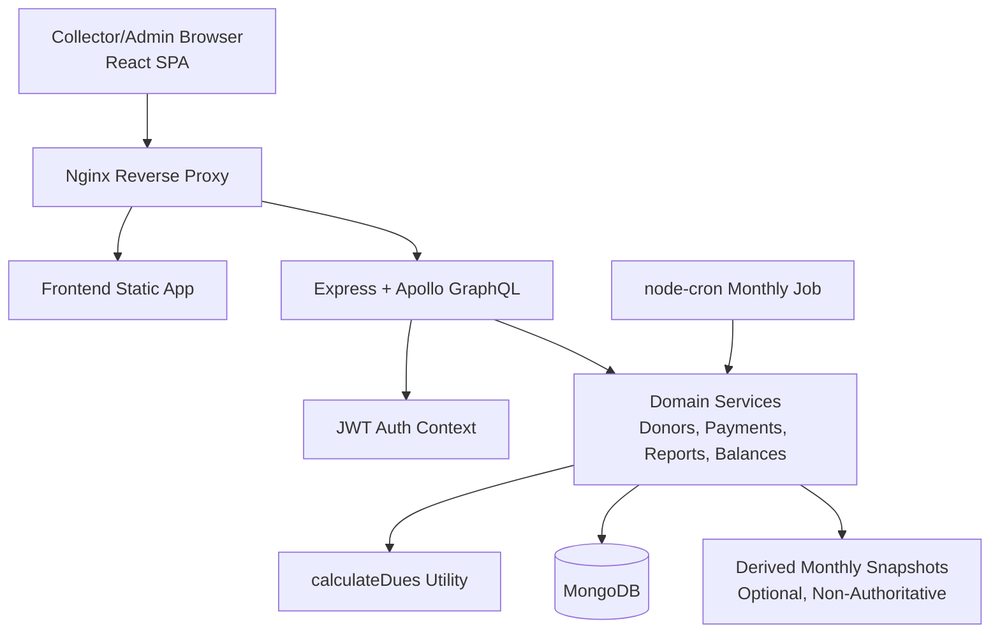

# Masik Chada Architecture Package

## Scope

This package locks the phase-1 architecture for the Masik Chada MERN rewrite based on the source spec and scoped brief. It is intentionally conservative: prioritize mobile donation speed, dues correctness, migration safety, and a GraphQL contract that can survive Android reuse.

## Requirements Summary

- Preserve the current Bengali-first workflow and labels while replacing Laravel/MySQL with React, Express/Apollo, MongoDB, and Nginx.
- Optimize the donations flow for mobile event collection, including fast donor lookup and immediate balance refresh after payment.
- Make `calculateDues` the only authoritative balance logic across the system.
- Allow `due_from` amnesty dates without introducing a second balance authority.
- Keep the GraphQL surface stable enough for a later Android client.
- Keep MongoDB private behind the Docker Compose network.

## System Topology

## Boundary Decisions

- `frontend/` owns presentation, route guards, local auth state, query orchestration, and mobile interaction behavior.
- `backend/` owns auth, GraphQL schema, resolver orchestration, domain rules, migration scripts, cron execution, and PDF/report generation.
- `calculateDues` is a backend domain utility, not a frontend helper. The frontend only consumes returned balance fields.
- MongoDB stores donors, payments, users, and optional derived reporting snapshots. It does not store an authoritative running balance.
- Nginx is the only public entrypoint. `/` serves the SPA and `/graphql` proxies to Express/Apollo.

## Canonical Data Flow

### Donation Collection

1. Authenticated collector loads donors through GraphQL query results already shaped for mobile list rendering.
2. User searches locally with debounced input and server-side filtering fallback for large datasets.
3. Collector opens payment sheet and submits `recordPayment`.
4. Resolver validates auth context, writes the payment, recomputes donor aggregates from persisted payment data, and returns the refreshed donor balance payload.
5. Client updates cache immediately from mutation output; no second balance fetch is required for the happy path.

### Balance Calculation

1. Start date is `due_from` when present, otherwise `registration_date`.
2. Month counting is inclusive of both start month and current month.
3. `totalPaid` is aggregated from persisted payments.
4. Outstanding balance is always `calculateTotalDue(...) - totalPaid`.
5. Any dashboard, donor, donation, or report balance view must derive from this path.

## Auth And Error Handling

- JWT bearer auth is enforced at the GraphQL boundary and decoded into a request-scoped auth context.
- Resolvers must not read raw headers directly after auth middleware; they consume normalized context instead.
- Business errors should map to stable GraphQL error codes in `extensions.code` such as `UNAUTHENTICATED`, `FORBIDDEN`, `BAD_USER_INPUT`, `NOT_FOUND`, and `INTERNAL_SERVER_ERROR`.
- Payment mutation failures must be transactional at the application level: no success response unless the payment row is persisted and the refreshed balance is computed from committed state.
- Expired or invalid tokens must produce a consistent unauthenticated response so the frontend can clear auth state and redirect to `/login`.

## Specialist Interface Notes

### Backend Lead

- Implement balance computation in a dedicated domain module consumed by resolvers, reports, and cron code.
- Keep resolvers thin. Schema types should map to service outputs rather than embed business logic.
- Design the migration script so imported records preserve Bengali text, original dates, and payment ownership relationships before any balance derivation occurs.
- Treat cron persistence as reporting support only. If a snapshot is wrong, runtime balance queries must still remain correct because they derive from donors and payments.
- Apply [Monthly Dues Cron Idempotency And Snapshot Guardrails](./runbooks/monthly-dues-cron-guardrails.md) for keying, upsert semantics, per-donor isolation, and UTC month boundaries.

### Frontend Lead

- Treat returned balance fields as server-authoritative; do not recreate dues math in React.
- Shape the donations page around a single fast path: search, tap donor, submit payment, see updated balance.
- Cache updates should use mutation payloads to avoid extra round trips during live collection.
- Keep the GraphQL client layer thin and avoid coupling UI components to unstable backend internals.

### Data Lead

- Validate migrated donor/payment counts and spot-check balances with the same canonical calculation utility.
- Preserve nullable `due_from` and avoid backfilling fabricated dues rows during migration.

### Security Lead

- Keep MongoDB private on the Compose network and review JWT secret handling, token expiry, CORS, and GraphQL exposure.

## Risks And Countermeasures

- Missing Laravel/screenshots source of truth may cause UI drift.
  Mitigation: frontend should request screenshots or legacy branch access before final UI parity work.
- The spec mentions monthly dues records without a defined authoritative model.
  Mitigation: snapshots are allowed only as derived artifacts, never as balance truth.
- Large donor lists may hurt live-event search latency.
  Mitigation: default to lightweight donor list query shapes, debounced search, and mutation responses that include refreshed donor summaries.
- Migration may expose legacy edge cases in dates or malformed rows.
  Mitigation: make the importer idempotent, log row-level failures, and run balance spot checks after import.

## ADR Index

- [ADR-001: Modular Monolith Topology](./adrs/ADR-001-modular-monolith-topology.md)
- [ADR-002: Canonical Dues And Balance Model](./adrs/ADR-002-canonical-dues-and-balance-model.md)
- [ADR-003: Stable GraphQL Contract For Web And Android](./adrs/ADR-003-stable-graphql-contract.md)
- [ADR-004: Monthly Cron Uses Derived Snapshots Only](./adrs/ADR-004-cron-derived-snapshots.md)
- [Runbook: Monthly Dues Cron Idempotency And Snapshot Guardrails](./runbooks/monthly-dues-cron-guardrails.md)
