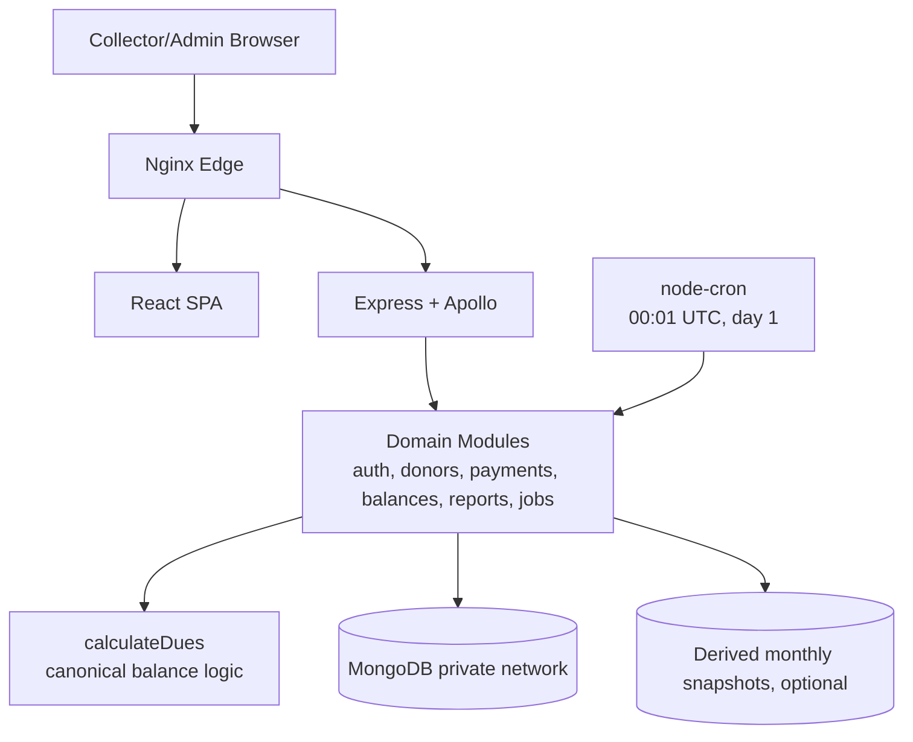

# Runtime And Cron Topology Review (MYMA-68)

## Scope Reviewed

- [Architecture Package README](./README.md)
- [ADR-001: Modular Monolith Topology](./adrs/ADR-001-modular-monolith-topology.md)
- [ADR-004: Monthly Cron Uses Derived Snapshots Only](./adrs/ADR-004-cron-derived-snapshots.md)
- [Monthly Dues Cron Idempotency And Snapshot Guardrails](./runbooks/monthly-dues-cron-guardrails.md)

## Topology Validation

The phase-1 runtime shape is valid for current scale and delivery constraints:

- Public edge: Nginx only.
- App tier: React SPA + Express/Apollo modular monolith.
- Data tier: private MongoDB on Compose internal network.
- Monthly processing: in-process `node-cron` inside backend for derived monthly work.

This is consistent with the accepted modular-monolith decision and keeps `calculateDues` as the single balance authority.

## Service Boundary Diagram (Runtime)

## Critical Failure Modes And Recommendations

1. Cron double-execution risk during restarts or scale-out.
- Recommendation: enforce singleton cron execution for phase 1 by running one backend replica only, and gate future horizontal scale behind explicit job-leader control.

2. Duplicate snapshot writes on reruns.
- Recommendation: enforce unique index on `(donor_id, month_key)` and only use idempotent upserts for snapshot persistence.

3. Hidden second source of truth through snapshot reads.
- Recommendation: prohibit donor/dashboard/payment balance reads from snapshot collections; all user-facing balances must flow through canonical donor+payment calculation.

4. Time-boundary drift across hosts.
- Recommendation: compute `month_key` in UTC only and schedule cron from UTC; reject locale-derived month keys in code review.

5. Batch fragility from single bad donor row.
- Recommendation: keep per-donor failure isolation with run summary counters (`scanned`, `written`, `failed`, `duration_ms`) and continue processing.

## Minimum Observability Hooks (Pre-Implementation Gate)

- Structured job logs with stable fields: `job_name`, `run_id`, `month_key`, `result`, `duration_ms`, `failed_count`.
- Backend readiness should expose cron scheduler registration state (single registration assertion on startup).
- Alert on missing monthly execution window (no successful run for current UTC month by expected threshold).
- Alert on repeated cron failures and on abnormal failed-donor ratio.

## Recovery Hooks (Pre-Implementation Gate)

- Manual rerun path for a specific `month_key` (`--month=YYYY-MM`) that is idempotent.
- Persist last successful monthly run metadata for operational verification.
- Runbook step to disable cron temporarily while keeping GraphQL runtime balance queries fully operational.

## Conclusion

No blocking architecture contradictions were found. The modular-monolith + in-process cron topology is acceptable for first deploy if singleton cron operation, idempotent snapshot writes, and anti-drift guardrails above are treated as mandatory implementation gates.

## Parent Linkage

This review is produced for:

- Parent architecture issue: `MYMA-55`
- Parent planning issue: `MYMA-49`
